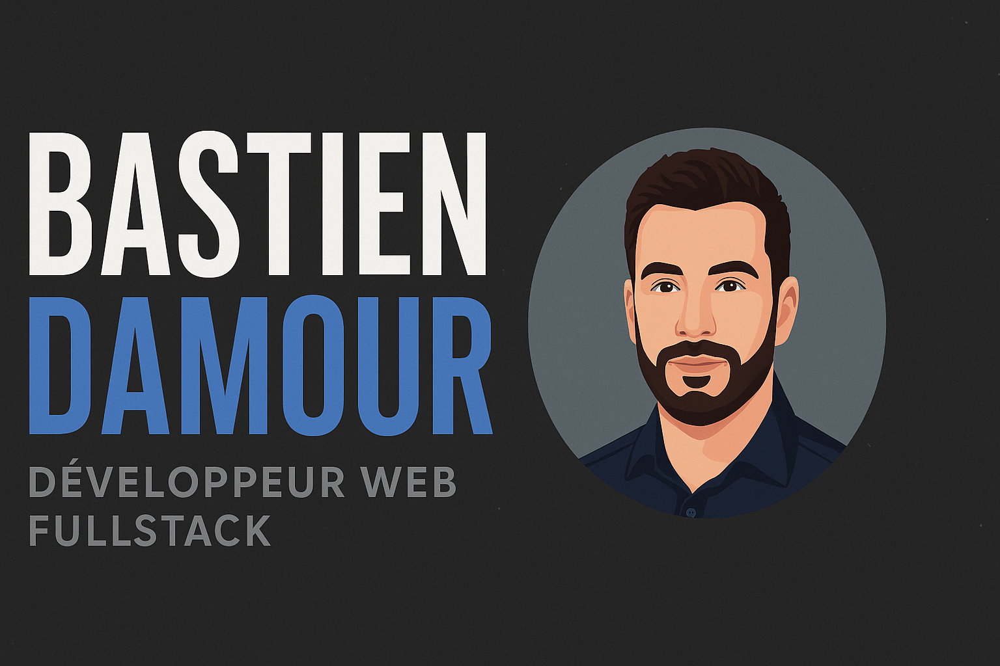

<h1 align="center">👨‍💻 Bastien Damour — Développeur Web Full Stack</h1>

<p align="center">
  
</p>

<p align="center">
  <a href="https://duffman033.github.io/damour-symfony-developer" target="_blank"><strong>🌐 Voir le CV en ligne</strong></a>
</p>

---

## ✨ Présentation

Bienvenue sur mon portfolio en ligne, développé en **HTML**, **CSS (Bootstrap)** et **JavaScript**.  
Ce site dynamique utilise un fichier `data.json` pour générer automatiquement les sections du CV.

---

## 🛠️ Stack technique

- 🎨 **HTML5 / CSS3 / Bootstrap 5.1**
- ⚙️ **JavaScript (vanilla)**
- 🧠 **Données dynamiques via `data.json`**
- 🌍 **Déployé avec GitHub Pages**
- 💬 Formulaire via [FormSubmit](https://formsubmit.co)

---

## 🔎 Structure du projet

```
📁 assets/              → Images, CV PDF, favicon
📁 css/                 → Fichier styles.css
📁 js/
 ├── dynamic.js        → Injection du contenu depuis data.json
 └── scripts.js        → Scrollspy + responsive navbar
📄 index.html           → Page principale
📄 data.json            → Données dynamiques (expériences, skills, etc.)
📄 README.md            → Ce fichier
📄 sitemap.xml          → Pour le SEO
📄 robots.txt           → Pour les moteurs de recherche
```

---

## 🚀 Déploiement

> Le site est hébergé via GitHub Pages.  
> Il est accessible ici :  
> 📎 **[https://bastien-damour.github.io](https://bastien-damour.github.io)**

---

## 📧 Contact

💼 **Email :** [bdamour72@gmail.com](mailto:bdamour72@gmail.com)  
🌐 **LinkedIn :** [linkedin.com/in/d-bastien](https://linkedin.com/in/d-bastien)  
💻 **GitHub :** [github.com/duffman033](https://github.com/duffman033)
